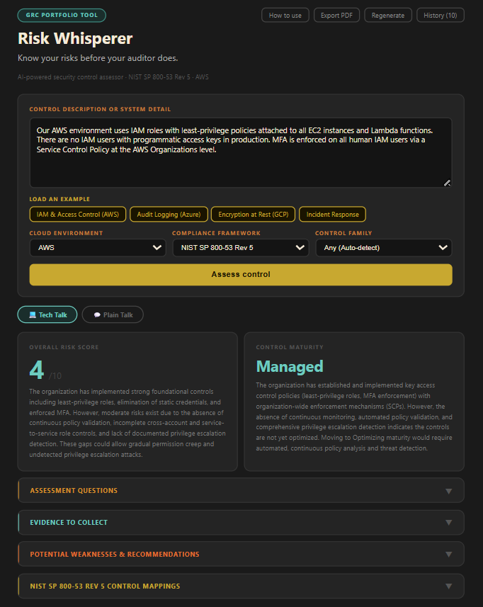

# Risk Whisperer
### AI-Powered Security Control Assessor

Risk Whisperer is a GRC portfolio tool that uses Claude AI to assess security controls against major compliance frameworks. Paste in a control description or system detail and instantly receive assessment questions, evidence requirements, potential weaknesses with remediation recommendations, and framework control mappings — the same outputs a senior GRC analyst would produce manually.

🔗 **Live app:** [riskwhisperer.vercel.app](https://riskwhisperer.vercel.app)

### 🔬 Tech Talk View


### 💼 Business View


---

## What It Does

| Output | What It Means |
|---|---|
| Risk Score (1-10) | Overall risk level of the described control |
| Control Maturity | How mature the control is (Initial → Optimizing) |
| Assessment Questions | Interview questions an auditor would ask |
| Evidence to Collect | Artifacts and screenshots needed for an audit package |
| Weaknesses & Recommendations | Gaps identified with specific remediation steps |
| Framework Mappings | Which official controls apply, with rationale |

> Risk Whisperer targets **Stage 2 of the audit lifecycle (Control Assessment)** — automating the outputs that feed directly into evidence collection and findings documentation.

---

## Features

- 🔬 **Tech Talk / 💼 Business View toggle** — switch output between GRC technical language and plain business language for executives, legal, or finance stakeholders. Translation is generated on demand via a second AI call and cached for instant toggling
- 🔒 **Secure API proxy** — the Anthropic API key lives server-side in a Vercel serverless function, never exposed in the browser
- ⏳ **Rotating loading messages** — descriptive status updates during the AI assessment so you always know what's happening
- 🗂 **Collapsible output cards** — expand only what you need
- 💾 **Persistent history** — assessments survive closing the browser tab via localStorage
- 📱 **Installable PWA** — add to your phone or desktop home screen, launches like a native app
- ⚠️ **Smart error handling** — specific messages for bad API keys, rate limits, and network failures
- 📄 **Export PDF** — save the full assessment report
- 📋 **Copy buttons** — copy individual sections to clipboard
- 🧪 **Example presets** — four pre-filled controls to demo the tool instantly
- 🔄 **Regenerate button** — re-run the assessment on current input

---

## Supported Frameworks

- NIST SP 800-53 Rev 5
- NIST CSF 2.0
- FedRAMP Moderate / High
- CIS Controls v8
- ISO 27001:2022
- SOC 2 Type II
- PCI DSS v4.0
- HIPAA Security Rule
- CMMC 2.0
- CISA Zero Trust Maturity Model
- NIST SP 800-171
- NERC CIP
- GDPR

## Supported Cloud Environments

AWS · AWS GovCloud · Azure · Azure Government · GCP · Oracle Cloud (OCI) · Multi-cloud · Hybrid · On-premises

---

## Getting Started

### Prerequisites

- Node.js (v16 or higher)
- An Anthropic API key (get one at [console.anthropic.com](https://console.anthropic.com))

### Installation

1. **Clone the repository**
```bash
git clone https://github.com/bettybangs/Risk-Whisperer.git
cd Risk-Whisperer
```

2. **Install dependencies**
```bash
npm install
```

3. **Add your API key**
   Create a `.env` file in the root folder:
   ```
   ANTHROPIC_API_KEY=your-api-key-here
   ```

4. **Start the app**
```bash
npm start
```
   The app opens at `http://localhost:3000`

### Deployment (Vercel)

The app uses a serverless function (`api/assess.js`) to proxy API calls securely. When deploying to Vercel, add `ANTHROPIC_API_KEY` as an environment variable in your Vercel project settings. Do **not** use the `REACT_APP_` prefix — the key should only be accessible server-side.

---

## Architecture

```
Browser → /api/assess (Vercel serverless function) → Anthropic API
```

The React frontend never touches the API key directly. All requests go through the serverless proxy, which injects the key from Vercel's environment variables server-side.

---

## Built With

- [React](https://react.dev/) — frontend UI
- [Anthropic Claude API](https://anthropic.com) — AI assessment engine (claude-haiku-4-5)
- [Vercel](https://vercel.com) — deployment and serverless functions

---

*Risk Whisperer is a portfolio and educational tool. Outputs should be reviewed by a qualified GRC professional before use in formal audits or compliance programs.*
